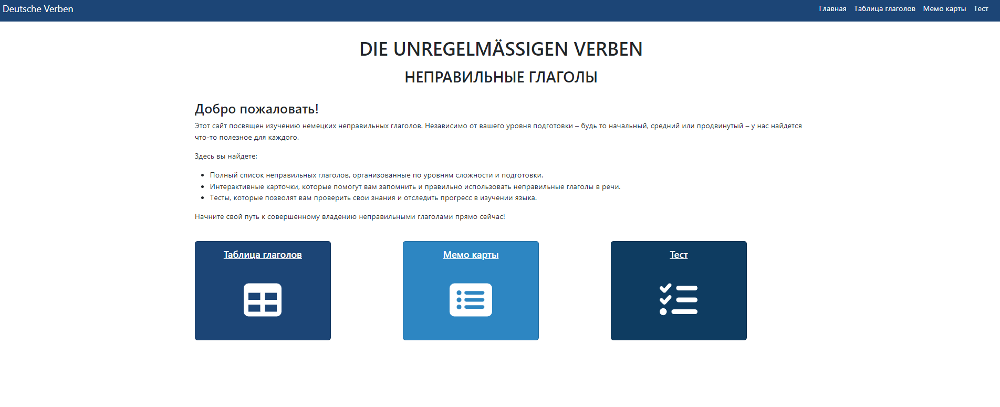

# Deutsche Verben App

The App is for learning German Irregular verbs. 
The App based on React Library.

## REACT APP

### Install & Run
- `npm install`             - install npm modules
- `npm run dev`             - run server

## APP Functions

Choose your own level, listen cards with speech function, test your results.

### Main page

### Verb list page

### Memo cards page

### Test page

